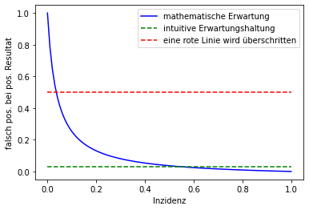

# Stochastik und die Überraschungen der Unwissenden

Einfache Zusammenhänge viel zitierter Größen zum Nachlesen und Experimentieren

- statische Version (gemäß den aktuellen Mindestanforderungen an Corona-Schnelltests): 

- dynamische Version (zum Anpassen der Parameter und Experimentieren): 

